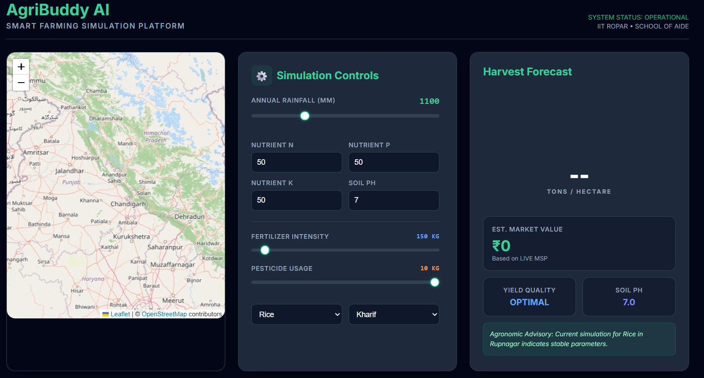

# AgriBuddy 🌾

**Geospatial Digital Twin for Precision Agriculture**

AgriBuddy is an intelligent agricultural analytics platform that leverages geospatial data, machine learning, and modern cloud infrastructure to empower farmers and agricultural professionals with data-driven insights for crop yield prediction and soil management.



---

## 🚀 Key Features

- **Geospatial Interface**: Interactive Leaflet.js map for auto-capturing GPS coordinates with reverse geocoding for district/state identification
- **Automated Data Injection**: Smart soil profile lookup system (N, P, K, pH) from internal district database—eliminating manual data entry
- **ML-Powered Predictions**: XGBoost Regressor trained on 10-feature vector (soil chemistry, rainfall, crop, season) with custom string sanitization for categorical consistency
- **Production-Ready Backend**: FastAPI with CORS support, validation, and error handling
- **Cloud-Native Architecture**: Containerized with Docker and orchestrated via Kubernetes with:
  - Self-healing pod management
  - Load balancing via HPA (Horizontal Pod Autoscaler)
  - Zero-downtime rolling updates
- **Data Consistency Layer**: Custom preprocessing pipeline ensuring categorical parity between training and inference

---

## 📊 Tech Stack

### Backend
- **Framework**: FastAPI
- **ML/ML Ops**: XGBoost, scikit-learn, pandas, numpy
- **Containerization**: Docker
- **Orchestration**: Kubernetes
- **Server**: Uvicorn

### Frontend
- **Library**: React 19
- **UI/Map**: Leaflet.js, React-Leaflet
- **Charting**: Chart.js, react-chartjs-2
- **Build Tool**: Vite
- **HTTP Client**: Axios
- **Linting**: ESLint

### Data Pipeline
- Automated soil profile injection
- District-level soil chemistry database
- State-wise statistical aggregation for smart defaults

---

## 📁 Project Structure

```
AgriBuddy/
├── backend/
│   ├── main.py                      # FastAPI application entry point
│   ├── soil_processing.py           # Soil data pipeline and injection
│   ├── train_model.py               # XGBoost model training script
│   ├── prepare_final_data.py        # Data preprocessing and feature engineering
│   ├── requirements.txt             # Python dependencies
│   ├── Dockerfile                   # Container image definition
│   ├── .dockerignore               # Docker build context excludes
│   ├── models/                     # Serialized ML artifacts
│   │   ├── yield_model.pkl
│   │   ├── le_crop.pkl
│   │   ├── le_state.pkl
│   │   └── le_season.pkl
│   └── k8s/                        # Kubernetes manifests
│       ├── backend-deployment.yaml
│       └── backend-service.yaml
│
└── frontend/
    ├── src/
    │   ├── main.jsx                # React entry point
    │   ├── App.jsx                 # Main App component
    │   ├── App.css                 # Global styles
    │   ├── index.css               # Base styles
    │   ├── components/
    │   │   ├── AnalysisBoard.jsx   # Yield analysis display
    │   │   ├── FarmMap.jsx         # Interactive geospatial map
    │   │   └── InputPanel.jsx      # Prediction form
    │   ├── services/
    │   │   └── api.js              # API client (axios)
    │   └── assets/                 # Static assets
    ├── public/                     # Static files
    ├── package.json
    ├── vite.config.js
    ├── eslint.config.js
    └── index.html
```

---

## 🛠️ Installation & Setup

### Prerequisites
- Python 3.9+
- Node.js 16+
- Docker (optional, for containerization)
- Kubernetes cluster (optional, for deployment)

### Backend Setup

1. **Navigate to backend directory**:
   ```bash
   cd backend
   ```

2. **Create a virtual environment**:
   ```bash
   python -m venv venv
   source venv/bin/activate  # On Windows: venv\Scripts\activate
   ```

3. **Install dependencies**:
   ```bash
   pip install -r requirements.txt
   ```

4. **Ensure model artifacts are in place**:
   ```
   backend/models/
   ├── yield_model.pkl
   ├── le_crop.pkl
   ├── le_state.pkl
   └── le_season.pkl
   ```

5. **Run the FastAPI server**:
   ```bash
   uvicorn main:app --reload --host 0.0.0.0 --port 8000
   ```
   Server will be available at `http://localhost:8000`
   API docs: `http://localhost:8000/docs`

### Frontend Setup

1. **Navigate to frontend directory**:
   ```bash
   cd frontend
   ```

2. **Install dependencies**:
   ```bash
   npm install
   ```

3. **Start development server**:
   ```bash
   npm run dev
   ```
   Frontend will be available at `http://localhost:5173`

---

## 🐳 Docker Deployment

### Build Backend Docker Image

```bash
cd backend
docker build -t agribuddy-backend:latest .
docker run -p 8000:8000 agribuddy-backend:latest
```

### Volume Mounts
Ensure the following directories are mounted:
- `/app/models/` - Contains serialized model artifacts

---

## ☸️ Kubernetes Deployment

1. **Build and push Docker image** (to your registry):
   ```bash
   docker build -t your-registry/agribuddy-backend:latest backend/
   docker push your-registry/agribuddy-backend:latest
   ```

2. **Apply Kubernetes manifests**:
   ```bash
   kubectl apply -f backend/k8s/backend-deployment.yaml
   kubectl apply -f backend/k8s/backend-service.yaml
   ```

3. **Verify deployment**:
   ```bash
   kubectl get deployments
   kubectl get services
   kubectl logs -l app=agribuddy-backend
   ```

### K8s Features Enabled
- **Horizontal Pod Autoscaler**: Automatically scales based on CPU/memory metrics
- **Rolling Updates**: Zero-downtime deployments with configurable strategy
- **Self-Healing**: Pod restart on failure with liveness/readiness probes
- **Service Discovery**: LoadBalancer/ClusterIP exposure for frontend communication

---

## 📡 API Endpoints

### `/get-soil-defaults`
**POST** - Get soil parameters for a given district/state

**Request**:
```json
{
  "district": "Pune",
  "state": "Maharashtra"
}
```

**Response**:
```json
{
  "n": 45.2,
  "p": 32.1,
  "k": 185.5,
  "ph": 6.8,
  "source": "district_name"
}
```

### `/api/predict`
**POST** - Predict crop yield based on soil and environmental parameters

**Request**:
```json
{
  "state": "Maharashtra",
  "crop": "Rice",
  "season": "Kharif",
  "nitrogen": 45.2,
  "phosphorus": 32.1,
  "potassium": 185.5,
  "ph": 6.8,
  "rainfall": 750.5,
  "temperature": 28.5,
  "humidity": 65.0
}
```

**Response**:
```json
{
  "predicted_yield": 4250.75,
  "confidence": 0.92,
  "unit": "kg/hectare"
}
```

---

## 🎯 Data Pipeline

### Training Data Preparation
1. **Data Collection**: Gather soil chemistry, weather, and crop yield records
2. **Feature Engineering**: 10-feature vector construction
3. **String Sanitization**: Categorical value standardization
4. **Model Training**: XGBoost Regressor with hyperparameter tuning
5. **Artifact Export**: Serialize model and label encoders

### Inference Pipeline
1. **Input Validation**: Pydantic models ensure type safety
2. **Categorical Encoding**: Apply trained label encoders
3. **Feature Scaling**: Normalize numerical features (if required)
4. **Prediction**: XGBoost model inference
5. **Post-Processing**: Format and validate output

---

## 🗺️ Frontend Usage

### Interactive Map (FarmMap Component)
- Click on the map to capture GPS coordinates
- Auto-reverse geocoding retrieves district and state
- Auto-populated soil data via backend lookup

### Prediction Form (InputPanel Component)
- Input crop, season, and environmental parameters
- Soil parameters pre-filled from district database
- Submit for yield prediction

### Analysis Dashboard (AnalysisBoard Component)
- Visualize predictions with Chart.js
- Display confidence metrics
- Historical prediction trends

---

## 🔄 Development Workflow

### Running Locally (Full Stack)

**Terminal 1 - Backend**:
```bash
cd backend
source venv/bin/activate
uvicorn main:app --reload
```

**Terminal 2 - Frontend**:
```bash
cd frontend
npm run dev
```

---

## 📊 Machine Learning Model

**Algorithm**: XGBoost Regressor

**Input Features** (10-vector):
1. Nitrogen (N) - mg/kg
2. Phosphorus (P) - mg/kg
3. Potassium (K) - mg/kg
4. Soil pH - unitless
5. Rainfall - mm
6. Temperature - °C
7. Humidity - %
8. Crop (encoded)
9. Season (encoded)
10. State (encoded)

**Output**: Crop yield prediction (kg/hectare)

**Training Data**: Historical agricultural records with validated soil and weather measurements

---

## 🚀 Performance Optimizations

- **Model Caching**: XGBoost model loaded at startup, reused across requests
- **Database Indexing**: District-state lookups optimized for O(1) retrieval
- **State-wise Aggregation**: Pre-calculated means reduce computation time
- **CORS Enabled**: Efficient cross-origin requests from frontend
- **Kubernetes HPA**: Auto-scales under load to maintain sub-second latency

---

## 🤝 Contributing

Contributions are welcome! Please follow these steps:

1. Fork the repository
2. Create a feature branch (`git checkout -b feature/amazing-feature`)
3. Commit changes (`git commit -m 'Add amazing feature'`)
4. Push to branch (`git push origin feature/amazing-feature`)
5. Open a Pull Request

---

## 📄 License

This project is licensed under the MIT License—see the LICENSE file for details.

---

## 🎓 Key Achievements

✅ **Geospatial Automation**: Eliminated manual coordinate entry via reverse geocoding  
✅ **Data Injection**: Automated soil profile lookup from district database  
✅ **ML Accuracy**: XGBoost model trained on 10-feature vector with categorical consistency  
✅ **Cloud-Ready**: Full Kubernetes support with auto-scaling and zero-downtime updates  
✅ **Production Grade**: CORS, validation, error handling, and structured logging  

---

## 📞 Support

For issues, questions, or suggestions, please open an issue on the GitHub repository.

---

**Built with ❤️ for precision agriculture**
